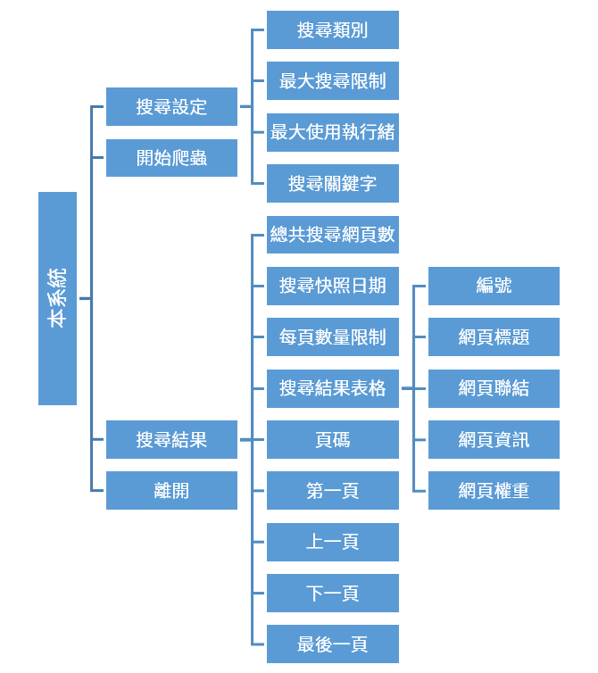
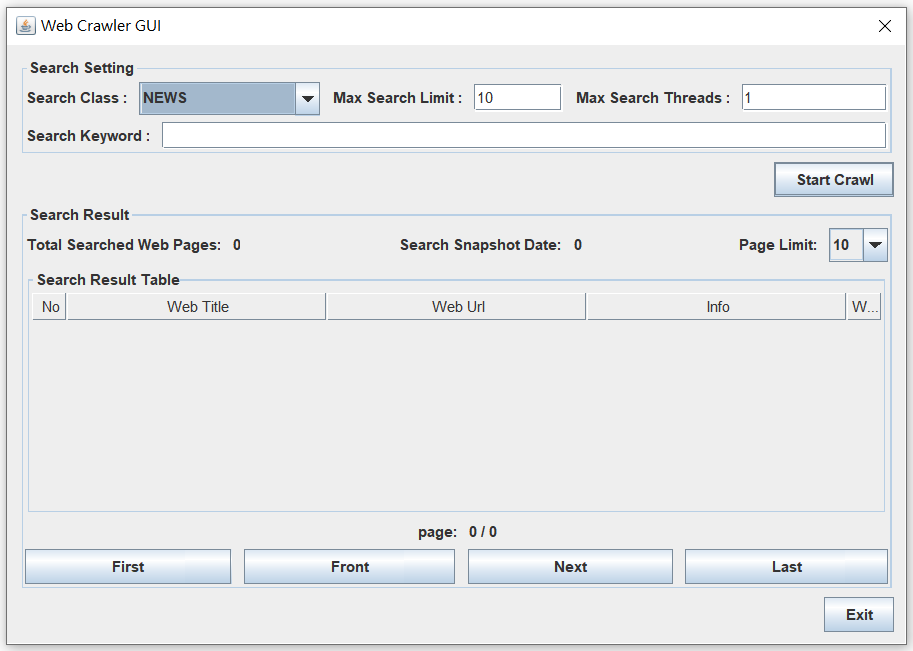
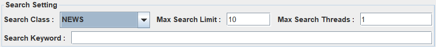
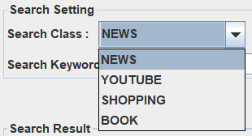
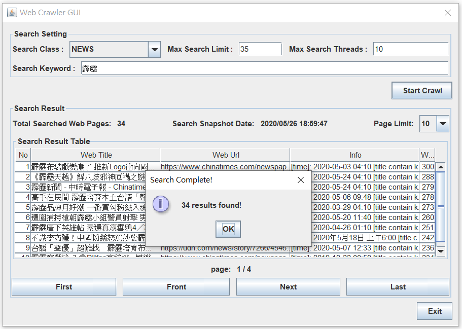

# Web Crawler GUI

## 1. 簡介
以上課講述之網路爬蟲程式為基礎，開發設計一具有視窗介面之爬蟲程式。該系統提供搜尋類別讓使用者選擇要搜尋之方向，以及搜尋欄位供使用者輸入。在搜尋完成後，仿照Google等搜尋平台設計顯示搜尋結果，並提供「第一頁」、「上一頁」、「下一頁」、「最後一頁」等功能來讓使用者檢索。

## 2. 問題
設計一個圖形視窗可分成兩個panel以上：
1. 第一個panel 有兩個元件，一個名為「類別」的下拉式選單，內有 ”電子報”、”購物網站”、”YouTube” 等至少三種以上選單;另一個元件是textfield，可接受USER輸入關鍵字。

2. 第二個panel可SHOW搜尋結果。panel以分頁方式顯示所有搜尋結果，每一網頁最多顯示10筆結果，最多3頁。所以，下panel必須提供總共幾頁，以及「第一頁」、「上一頁」、「下一頁」、「最後一頁」按鈕供USER使用。

3. 仿造google搜尋結果畫面，選擇一個類別，再輸入一個關鍵字，這個panel可show出所有links(含關鍵字)。例如:類別選”電子報”，關鍵字=”台南大學”，下面panel將show出所有含有”台南大學”的電子報網頁links，儲存最好的30個links。

4. 至少3個入口網站，依類別可有不同設計。

5. 輸出links，必須給予權重，權重最高者排第一位，依此類推。例如，關鍵字完全吻合，權重最大，日期又是最新，應是第一個被輸出。請在書面報告中，詳細介紹權重計算方式。

6. 必須建立資料庫，儲存所有已搜尋到關鍵字和對應的links，生命週期為24小時。

---
## 成品簡介
本系統為一簡易的爬蟲系統，提供使用者以搜尋類別與關鍵字搜尋網頁。而網頁的結果將依搜尋類而有不同的演算法排序，例如：新聞類別著重在標題內容與最新時間；Youtube類別則著重在觀看數量與喜歡比例。

### 系統架構
本系統依設計可細分為四個功能：搜尋設定、開始爬蟲、搜尋結果、離開。搜尋設定中還可再細分四個功能：搜尋類別、最大搜尋限制、最大使用執行緒、搜尋關鍵字。搜尋結果也可再細分為：總共搜尋網頁數、搜尋快照日期、每頁數量限制、搜尋結果表格、頁碼、第一頁、上一頁、下一頁、最後一頁。其中搜尋結果表格可再分為：編號、網頁標題、網頁連結、網頁資訊、網頁權重。詳細架構圖請見下圖。  

### 介面說明
剛啟動本系統時的介面。  
  

搜尋設定細節。  

搜尋類別項目，包含新聞、Youtube、購物、書籍等四個項目。  

輸入完搜尋關鍵字後搜尋完畢的介面顯示。  

